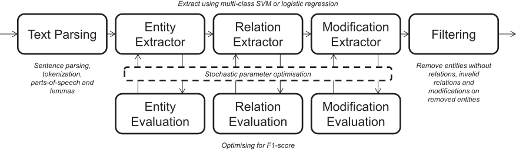
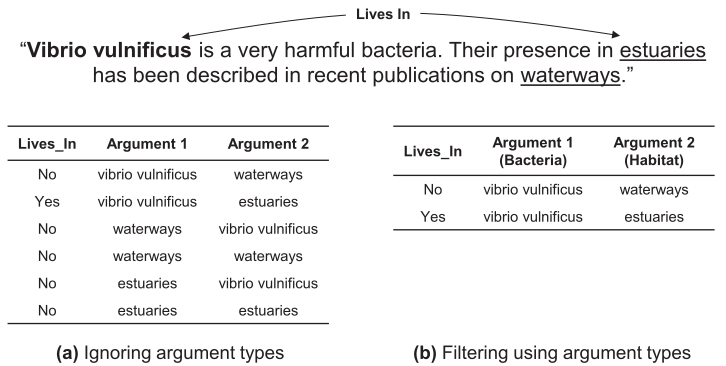
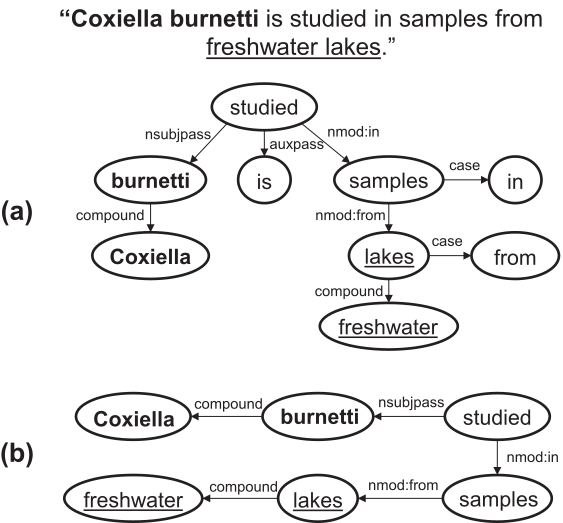
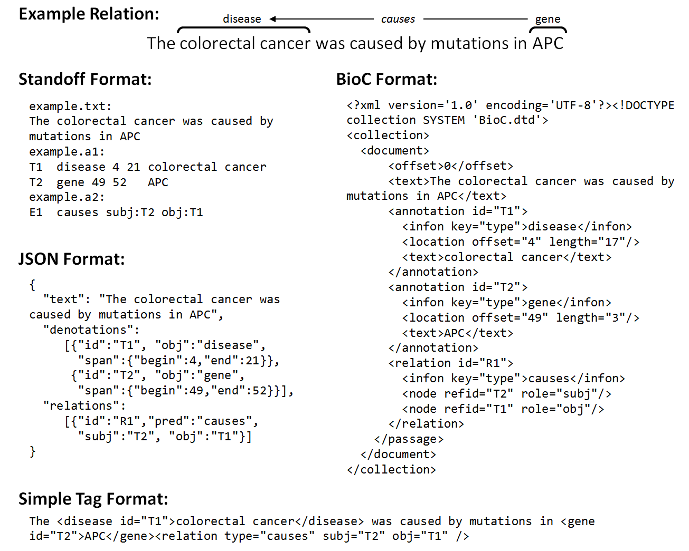
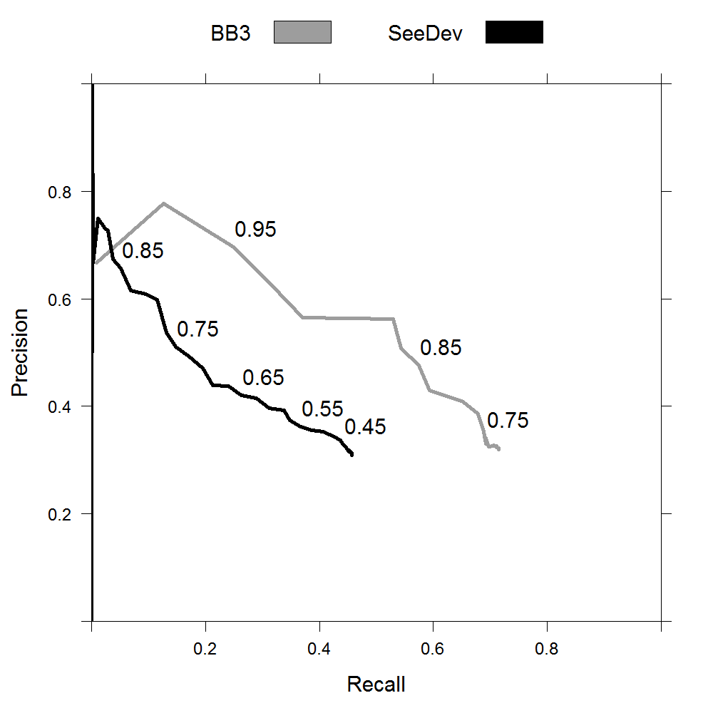
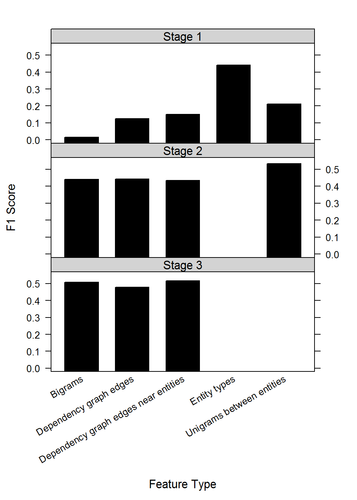
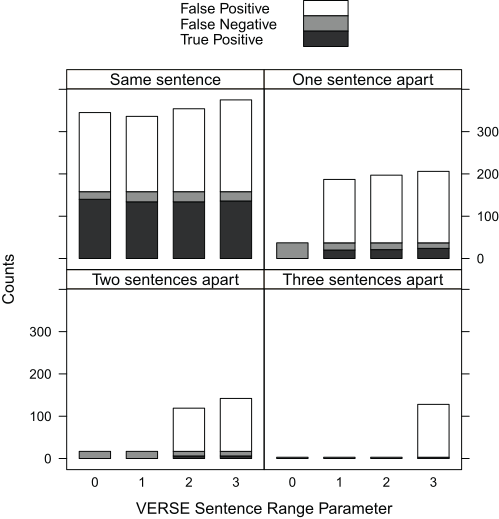

# Relation extraction with VERSE and Kindred

## Introduction

Extracting knowledge from biomedical literature is a huge challenge in the natural language parsing field and has many applications including knowledge base construction and question-answering systems. In this chapter, we describe our competition winning event extraction system (VERSE) and its followup highly interoperable relation extraction Python package (Kindred).

Event extraction systems focus on this problem by identifying specific events and relations discussed in raw text. Events are described using three key concepts, entities, relations and modifications. Entities are spans of text that describe a specific concept (e.g. a gene). Relations describe a specific association between two (or potentially more) entities. Together entities and relations describe an event or set of events (such as complex gene regulation). Modifications are changes made to events such as speculation.

The BioNLP Shared Tasks have encouraged research into new techniques for a variety of important NLP challenges. Occurring in 2009, 2011 and 2013, the competitions were split into several subtasks [@kim2009overview; @kim2011overview; @nedellec2013overview]. These subtasks provided annotated texts (commonly abstracts from PubMed) of entities, relations and events in a particular biomedical domain. Research groups were then challenged to generate new tools to better predict new relations and events in test data.

The BioNLP 2016 Shared Task contains three separate parts, the Bacteria Biotope subtask (BB3), the Seed Development subtask (SeeDev) and the Genia Event subtask (GE4). The BB3 and SeeDev subtasks have separate parts that specialise in entity recognition and relation extraction. The GE4 subtask focuses on full event extraction of NFkB related gene events.

Previous systems for relation and event extraction have taken two main approaches: rule-based and feature-based. Rule-based methods learn specific patterns that fit different events, for instance, the word "expression" following a gene name generally implies an expression event for that gene. The pattern-based tool BioSem [@bui2013fast] in particular performed well in the Genia Event subtask of the BioNLP'13 Shared Task. Feature-based approaches translate the textual content into feature vectors that can be analysed with a traditional classification algorithm. Support vector machines (SVMs) have been very popular with successful relation extraction tools such as TEES [@bjorne2013tees].

### VERSE

We will first present the Vancouver Event and Relation System for Extraction (VERSE) for the BB3 event subtask, the SeeDev binary subtask and the Genia Event subtask. Utilising a feature-based approach, VERSE builds on the ideas of the TEES system. It offers control over the exact semantic features to use for classification, allows feature selection to reduce the size of feature vectors and uses a stochastic optimisation strategy with k-fold cross-validation to identify the best parameters. We examine the competitive results for the various subtasks and also analyse VERSE's capability to predict relations across sentence boundaries.

The VERSE method came first in the BB3 event subtask and third in the SeeDev binary subtask in the BioNLP Shared Task 2016. An analysis of the two systems that outperformed VERSE in the SeeDev subtask points to interesting directions for further development. The SeeDev subtask differs greatly from the BB3 subtask as there are 24 relation types compared to only 1 in BB3 and the training set size for each relation is drastically smaller. The LitWay approach, which came first, uses a hybrid approach of rule-based and vector-based [@li2016litway]. For "simpler" relations, defined using a custom list, a rule-based approach uses a predefined set of patterns. The UniMelb approach created individual classifiers for each relation type and was able to predict multiple relations for a candidate relation [@panyam2016seedev]. This approach of treating relation types differently suggests that there may be large differences in how a relation should be treated in terms of the linguistic cues used to identify it and the best algorithm approach to identify it.

### Kindred

There are several shortcomings in the approaches to the BioNLP Shared Tasks, the greatest of all is the poor number of participants that provide code. It is also clear that the advantages of some of the most successful tools are tailored specifically to these datasets and may not be able to generalize easily to other relation extraction tasks. Some tools that do share code such as TEES and VERSE have a large number of dependencies, though TEES ameliorates this problem with an excellent installing tool that manages dependencies. These tools can also be computationally costly, with both TEES and VERSE taking a parameter optimization strategy that requires a cluster for reasonable performance. 

The biomedical text mining community is endeavoring to improve consistency and ease-of-use for text mining tools. In 2012, the Biocreative BioC Interoperability Initiative [@comeau2014bioc] encouraged researchers to develop biomedical text mining tools around the BioC file format [@comeau2013bioc]. More recently, one of the Biocreative BeCalm tasks focuses on "technical interoperability and performance of annotation servers" for a named entity recognition systems. This initiative encourages an ecosystem of tools and datasets that will make text mining a more common tool in biology research. PubAnnotation [@kim2012pubannotation], which is part of this approach, is a public resource for sharing annotated biomedical texts. The hope of this resource is to provide data to improve biomedical text mining tools and as a launching point for future shared tasks. The PubTator tool [@wei2013pubtator] provides PubMed abstracts with various biomedical entities annotated using several named entity recognition tools including tmVar [@wei2013tmvar] and DNorm [@leaman2013dnorm].

In order to overcome some of the challenges in the relation extraction community in terms of ease-of-use and integration, we present Kindred which is a successor to VERSE. Kindred is an easy-to-install Python package for relation extraction using a vector-based approach. It abstracts away much of the underlying algorithms in order to allow a user to easily start extracting biomedical knowledge from sentences. However, the user can easily use individual components of Kindred in conjunction with other parsers or machine learning algorithms. It integrates seamlessly with PubAnnotation and PubTator to allow easy access to training data and text to be applied to. Furthermore, we show that it performs very well on the BioNLP Shared Task 2016 relation subtasks.

## VERSE Methods

The VERSE system competed in the BioNLP Shared Task 2016 and the methods are outlined here.

### Pipeline

```{r pipeline, echo=F, eval=T, out.width='90%', fig.align='center', fig.cap='(ref:pipeline)'}

```

(ref:pipeline) Overview of VERSE pipeline

VERSE breaks event extraction into five steps outlined in the pipeline shown in Figure \@ref(fig:pipeline). Firstly the input data is passed through a text processing tool that splits and tags text and associates the parsed results with the provided annotations. This parsed data is then passed through three separate classifications steps for entities, relations and modifications. Finally, the results are filtered to make sure that all relations and modifications fit the expected types for the given task.

```{r candidateGeneration, echo=F, eval=T, out.width='90%', fig.align='center', fig.cap='(ref:candidateGeneration)'}

```

(ref:candidateGeneration) Relation candidate generation for the example text which contains a single Lives\_In relation (between bacteria and habitat). The bacteria entity is shown in bold and the habitat entities are underlined. Relation example generation creates pairs of entities that will be vectorised for classification. (a) shows all pairs matching without filtering for specific entity types (b) shows filtering for entity types of bacteria and habitat for a potential Lives_In relation

### Text processing

VERSE can accept input in the standard BioNLP-ST format or the PubAnnotation JSON format [@kim2012pubannotation]. The annotations describe entities in the text as spans of text and relations and modifications of these entities.

The input files for the shared subtasks are initially processed using the Stanford CoreNLP toolset. The texts are split into sentences and tokenized. Parts-of-speech and lemmas are identified and a dependency parse is generated for each sentence. CoreNLP also returns the exact positions of each token. Using this data, an interval tree is created to identify intersections of text with entities described in the associated annotation. The specific sentence and locations of each associated word are then stored for each entity. Relations and modifications described in the associated annotations are also loaded, retaining information on which entities are involved. 

The entities in the BB3 and SeeDev subtasks are generally sets of full words but can be non-contiguous. Entities are stored as a set of associated words rather than a span of words. The GE4 task also contains entities that contain only partial words, for example, "PTEN" is tagged as an entity within "PTEN-deficient". A list of common prefixes and suffixes from the GE4 task is used to separate these words into two words so that the example would become "PTEN deficient". Furthermore, any annotation that divides a word that contains a hyphen or forward slash causes the word to be separate into two separate words.

For easier interoperability, the text parsing code was developed in Jython [@developers2008jython] (a version of Python that can load Java libraries, specifically the Stanford CoreNLP toolset). This Jython implementation is then able to export easily processed Python data structures. Due to incompatibility between Jython and various numerical libraries, a separate Python-only implementation loads the generated data structures for further processing and classification.

### Candidate generation

For all three classifications steps (entities, relations and modifications), the same machine learning framework is used. All possible candidates are generated for entities, relations or modifications. For relations, this means all pairs of entities are found (within a certain sentence range). For the training step, the candidates are associated with a known class (i.e. the type of relation), or the negative class if the candidate is not annotated in the training set. For testing, the classes are unknown. Candidates can contain one argument (for entity extraction and modification) or two arguments (for relation extraction). These arguments are stored as references to sentences and the indices of the associated words.


#### Entity extraction

Entity extraction aims to classify individual or sets of words as a certain type of entity, given a set of training cases. Entities may contain non-contiguous words. The set of all possible combinations of words that could compose an entity is too large for the classification system. Hence VERSE filters for only combinations of words that are identified as entities in the training set. This means that if the term "Lake Como" is annotated as a Habitat entity in the training set, any instance of "Lake Como" will be flagged as a candidate Habitat entity. However if a term (e.g. "the River Thames") never appears as an entity in the training set, it will be ignored for all test data.

#### Relation extraction

VERSE can predict relations between two entities, also known as binary relations. Candidates for each possible relation are generated for every pair of entities that are within a fixed sentence range. Hence when using the default sentence range of 0, only pairs of entities within the same sentence are analysed. VERSE can optionally filter pairs of entities using the expected types for a set of relations as shown in Figure \@ref(fig:candidateGeneration).

Each candidate is linked with the locations of the two entities. If the two entities are already annotated to be in a relation, then they are labelled with the corresponding class. Otherwise, the binary relation candidate is annotated with the negative class.

#### Modification extraction

VERSE supports modification of entities in the form of event modification but currently does not support modification of individual relations. A modification candidate is created for all entities that form the base of an event. These entities are often known as the triggers of the event. In the JSON format, these entities traditionally have IDs that start with ``E". If a modification exists in the training set for that entity, the appropriate class is associated with it. Individual binary classifiers are generated for each modification type. This allows an event to be classified with more than one modification.


### Features {#versefeatures}

```{r features, echo=F, eval=T}
versefeatures <- read.table('data/versefeatures.tsv',header=T,sep='\t', stringsAsFactors=F)
versefeatures$Feature.Name <- gsub("~", "\n", versefeatures$Feature.Name)
versefeatures$Target <- gsub("~", "\n", versefeatures$Target)

suppressWarnings(versefeatures %>%
  dplyr::mutate_all(linebreak) %>%
  knitr::kable(
    booktabs = TRUE, escape=FALSE,
    caption = 'Overview of the various features that VERSE can use for classification',
    col.names = c('Feature Name','Target')
    ) %>%
  kable_styling())

```

For each generated candidate, a variety of features (controllable through a parameter) is calculated. The features focus on characteristics of the full sentence, dependency path or individual entities. The full-set is shown in Table \@ref(tab:features). Each feature group, shown in the table, can be included or excluded with a binary flag. It should also be noted that a term frequency-inverse document frequency (TFIDF) transform is also an option for all bag-of-words based features.

#### Full sentence features

N-grams features (unigrams and bigrams) use a bag-of-words approach to count the word occurrences across the whole sentence. The words are transformed to lowercase but notably are not filtered for stop words. A version combining the individual words with part-of-speech information is also used. A bag-of-words vector is also generated for lemmas of all words in the sentence. Skip-gram-like features are generated using two words separated by a fixed window of words are also used to generate features. Hence the terms "regulation of EGFR" and "regulation with EGFR" would match the same features of "regulation * EGFR".

#### Dependency path features

```{r dependencypath, echo=F, eval=T, out.width='90%', fig.align='center', fig.cap='(ref:dependencypath)'}

```

(ref:dependencypath) Dependency parsing of the shown sentence provides (a) the dependency graph of the full sentence which is then reduced to (b) the dependency path between the two multi-word terms. This is achieved by finding the subgraph which contains all entity nodes and the minimum number of additional nodes.

The dependency path is the shortest path between the two entities in a dependency parse graph and has been shown to be important for relation extraction [@bunescu2005shortest]. Features generated from the set of edges and nodes of the dependency graph include a unigrams and bigrams representation. The specific edge types in the dependency path are also captured with a bag-of-words vector. In order to give specific information about the location of the entity in the dependency path, the types of the edges leaving the entity nodes are recorded separately for each entity.

Interestingly an entity may span multiple nodes in the dependency graph. An example of a dependency path with the multi-word entities "coxiella burnetii" and "freshwater lakes" is shown in Figure \@ref(fig:dependencypath). In this case, the minimal subgraph that connects all entity nodes in the graph is calculated. This problem was transformed into a minimal spanning tree problem as follows and solved using the NetworkX Python package [@hagberg-2008-exploring]. The shortest paths through the graph were found for all pairs of entity nodes (nodes associated with the multi-word entities). The path distance between each pair was totalled and used to generate a new graph containing only the entity nodes. The minimal spanning tree was calculated and the associated edges recovered to generate the minimal subgraph. This approach would allow for a dependency path-like approach for relations between more than two entities.

#### Entity features

The individual entities are also used to generate specific features. Three different vectorised versions use a unigrams approach, a unigrams approach with parts-of-speech information and lemmas respectively. A one-hot vector approach is used to represent the type of each entity. Unigrams of words around each entity within a certain window size are also generated.

#### Multi-sentence and single entity features

VERSE is also capable of generating features for relations between two entities that are in different sentences. In this case, all sentence features are generated for both sentences together and no changes are made to the entity features.

The dependency path features are treated differently. The dependency path for each entity is created as the path from the entity to the root of the dependency graph, generally the main verb of the sentence. This then creates two separate paths, one per sentence and the features are generated in similar ways using these paths. Finally, a simple binary feature is generated for relation candidates that span multiple sentences.

For relation and modifications, candidates contain only a single argument. The dependency path is created in a similar manner to candidates of relations that span across sentences.

### Classification

All candidates are vectorized using the same framework, whether for candidates with one or two arguments with minor changes. These vectorized candidates are then used for training a traditional classifier. The vectors may be reduced using feature selection. Most importantly, the parameters used for the feature generation and classifier can easily be varied to find the optimal results. Classification uses the scikit-learn Python package [@scikit-learn].

#### Feature selection

VERSE implements optional feature selection using a chi-squared test on individual parameters against the class variable. The highest ranking features are then filtered based on the percentage of features desired.

#### Classifier parameters

Classification uses either a support vector machine (SVM) or logistic regression. When using the SVM, the linear kernel is used due to lower time complexity. The multi-class classification uses a one-vs-one approach. The additional parameters of the SVM that are optimised are the penalty parameter C, class weighting approach and whether to use the shrinking heuristic. The class weighting is important as the negative samples greatly outnumber the positive samples for most problems.

#### Stochastic parameter optimisation

VERSE allows adjustment of the various parameters including the set of features to generate, the classifier to use and the associated classification parameters. The optimisation strategy involves initially seeding 100 random parameter sets. After this initial set, the top 100 previous parameter sets are identified each iteration and one is randomly selected. This parameter set is then tweaked as follows. With a probability of 0.05, an individual parameter is changed. In order to avoid local maxima, an entirely new parameter set is generated with a probability of 0.1. For the subtasks, a 500 node cluster using Intel X5650s was used for optimisation runs. 

The optimal parameters are determined for the entity extraction, relation extraction and each possible modification individually. In order to balance precision and recall equally at each stage, the F1-score is used.

### Filtering

Final filtering is used to remove any predictions that do not fit into the task specification. Firstly all relations are checked to see that the types of the arguments are appropriate. Any entities that are not included in relations are removed. Finally, any modifications that do not have appropriate arguments or were associated with removed entities are also trimmed.

### Evaluation

An evaluation system was created that generates recall, precision, and associated F1-scores for entities, relations and modifications. The system works conservatively and requires exact matches. It should be noted that our internal evaluation system gave similar but not exactly matching results to the online evaluation system for the BB3 and SeeDev subtasks.

K-fold cross-validation is used in association with this evaluation system to assess the success of the system. The entity, relation and modification extractors are trained separately. For the BB3 and SeeDev subtasks, two-fold cross-validation is used, using the provided split of training and development sets as the training sets for the first and second fold respectively. For the GE4 task, five-fold cross-validation is used. The average F1-score of the multiple folds is used as the metric of success. 

## Kindred Methods

The Kindred package was built as a follow up to the VERSE system. It is designed for generalizable relation extraction, is integrated with a wide variety of biomedical text mining resources and is distributed as a self-contained Python package for easy use.

Kindred is a Python package that builds upon the Stanford CoreNLP framework [@manning2014stanford] and the scikit-learn machine learning library [@pedregosa2011scikit]. The decision to build a package was based on the understanding that each text mining problem is different. It seemed more valuable to make the individual features of the relation extraction system available to the community than a bespoke tool that was designed to solve a fixed type of biomedical text mining problem. Python was selected due to the excellent support for machine learning and the easy distribution of Python packages.

The ethos of the design is based on the scikit-learn API that allows complex operations to occur in very few lines of code, but also gives detailed control of the individual components. Individual computational units are encapsulated in separate classes to improve modularity and allow easier testing. Nevertheless, the main goal was to allow the user to download annotated data and build a relation extraction classifier in as few lines of code as possible. 

### Package development

The package has been developed for ease-of-use and reliability. The code for the package is hosted on Github. It was also developed using the continuous integration system Travis CI in order to improve the robustness of the tool. This allows regular tests to be run whenever code is committed to the repository. This will enable further development of Kindred and ensure that it continues to work with both Python 2 and Python 3. Coveralls and the Python coverage tool are used to evaluate code coverage and assist in test evaluation. 

These approaches were in line with the recent recommendations on improving research software [@taschuk2017ten]. We hope these techniques will allow for and encourage others to make use of and contribute to the Kindred package.

### Data Formats


```{r relationexample, echo=F, eval=T, out.width='90%', fig.align='center', fig.cap='(ref:relationexample)'}

```

(ref:relationexample) An example of a relation between two entities in the same sentence and the representations of the relation in four input/output formats that Kindred supports.

As illustrated in Figure \@ref(fig:relationexample), Kindred accepts data in four different formats: the standoff format used by BioNLP Shared Tasks, the JSON format used by PubAnnotation, the BioC format [@comeau2013bioc] and a simple tag format. The standoff format uses three files, a TXT file that contains the raw text, an A1 file that contains information on the tagged entities and an A2 file that contains information on the relations between the entities. The JSON, BioC and simple tag formats integrate this information into single files. The input text in each of these formats must have already been annotated for entities.

The simple tag format was implemented primarily for simple illustrations of Kindred and for easier testing purposes. It is parsed using an XML parser to identify all tags. A relation tag should contain a "type" attribute that denotes the relation type (e.g. causes). All other attributes are assumed to be arguments for the relation and their values should be IDs for entities in the same text. A non-relation tag is assumed to be describing an entity and should have an ID attribute that is used for associating relations.


### Parsing and Candidate Building

The text data is loaded, and where possible, the annotations are checked for validity. In order to prepare the data for classification, the first step is sentence splitting and tokenization. We use the Stanford CoreNLP toolkit for this which is also used for dependency parsing for each sentence.

Once parsing has completed, the associated entity information must then be matched with the corresponding sentences. An entity can contain non-contiguous tokens as was the case for the BB3 event dataset in the BioNLP 2016 Shared Task. Therefore each token that overlaps with an annotation for an entity is linked to that entity.

Any relations that occur entirely within a sentence are associated with that sentence. The decision to focus on relations contained within sentence boundaries is based on the poor performance of relation extraction systems in the past. The VERSE tool explored predicting relations that spanned sentence boundaries in the BioNLP Shared Task and found that the false positive rate was too high. The sentence is also parsed to generate a dependency graph which is stored as a set of triples $(token_i,token_j,dependency_{ij})$ where $dependency_{ij}$ is the type of edge in the dependency graph between tokens $i$ and $j$. The edge types use the Universal Dependencies format [@nivre2016universal].

Relation candidates are then created by finding every possible pair of entities within each sentence. The candidates that are annotated relations are stored with a class number for use in the multiclass classifier. The class zero denotes no relation. All other classes denote relations of specific types. The types of relations and therefore how many classes are required for the multiclass classifier are based on the training data provided to Kindred.

### Vectorization

Each candidate is then vectorized in order to transform the tokenized sentence and set of entity information into a numerical vector that can be processed using the scikit-learn classifiers. In order to keep Kindred simple and improve performance, it only generates a small set of features as outlined below. 

- Entity types in the candidate relation
- Unigrams between entities
- Bigrams for the full sentence
- Edges in dependency path
- Edges in dependency path that are next to each entity.

For the entity type and edge relations, they are stored in a  one-hot format. Entity specific features are created for each entity. For instance, if there are three relation types for relations between two arguments, then six binary features would be required to capture the entity types.

The unigrams and bigrams use a bag-of-words approach. Term-frequency inverse-document frequency (TF-IDF) is used for all bag-of-words based features. The dependency path, using the same method as VERSE, is calculated as the minimum spanning tree between the nodes in the dependency graph that are associated with the entities in the candidate relation.

### Classification

Kindred has in-built support for the support vector machine (SVM) and logistic regression classifiers implemented in scikit-learn. By default, the SVM classifier is used with the vectorized candidate relations. The linear kernel has shown to give good performance and is substantially faster to train than alternative SVM kernels such as radial basis function or exponential.

The success of the LitWay and UniMelb entries to the SeeDev shared task suggested that individual classifiers for unique relation types may give improved performance. This may be due to the significant differences in complexity between different relation types. For instance, one relation type may require information from across the sentence for good classification, whereas another relation type may require only the neighboring word.

Using one classifier per relation type, instead of a single multiclass classifier, means that a relation candidate may be predicted to be multiple relation types. Depending on the dataset, this may be the appropriate decision as relations may overlap. Kindred offers this functionality of one classifier per relation type. However, for the SeeDev dataset, we found that the best performance was actually through a single multiclass classifier.

### Filtering

The predicted set of relations is then filtered using the associated relation type and types of the entities in the relation. Kindred uses the set of relations in the training data to infer the possible argument types for each relation.

### Precision-recall tradeoff


```{r tradeoff, echo=F, eval=T, out.width='90%', fig.align='center', fig.cap='(ref:tradeoff)'}

```

(ref:tradeoff) The precision-recall tradeoff when trained on the training set for the BB3 and SeeDev results and evaluating on the development set using different thresholds. The numbers shown on the plot are the thresholds.


The importance of precision and recall depends on the specific text mining problem. The BioNLP Shared Task has favored the F1-score, giving an equal weighting to precision and recall. Other text mining projects may prefer higher precision in order to avoid biocurators having to manually filter out spurious results. Alternatively, projects may require higher recall in order to not miss any possibly important results. Kindred gives the user the control of a threshold for making predictions. In this case, the logistic regression classifier is used as it allows for easier thresholding. This is because the underlying predicted values can be interpreted as probabilities. We found that logistic regression achieved performance very close to the SVM classifier. By selecting a higher threshold, the classifier will become more conservative, decrease the number of false positives and therefore improve precision at the cost of recall. By using cross-validation, the user can get an idea of the precision-recall tradeoff. The tradeoffs for the BB3 and SeeDev tasks are shown in Figure \@ref(fig:tradeoff). This allows the user to select the appropriate threshold for their task.


### Parameter optimization

TEES took a grid-search approach to parameter optimization and focused on the parameters of the SVM classifier. VERSE had a significantly larger selection of parameters and grid search was not computationally feasible so a stochastic approach was used. Both approaches are computationally expensive and generally need a computer cluster.

Kindred takes a much simpler approach to parameter optimization and can work out of the box with default values. To improve performance, the user can choose to do minor parameter optimization. The only parameter optimized by Kindred is the exact set of features used for classification. This decision was made with the hypothesis that some relations potentially require words from across the sentence and other need only the information from the dependency parse.

The feature choice optimization uses a greedy algorithm. It calculates the F1-score using cross validation for each feature type. It then selects the best one and tries adding the remaining feature types to it. It continues growing the feature set until the cross-validated F1 score does not improve. 

Figure \@ref(fig:featurebuilding) illustrates the process for the BB3 subtask using the training set and evaluating on the development set. At the first stage, the entity types feature is selected. This is understandable as the types of entity are highly predictive of whether a candidate relation is reasonable for a particular candidate type, e.g. two gene entities are unlikely to be associated in a 'IS\_TREATMENT\_FOR' relation. At the next stage, the unigrams between entities feature is selected. And on the third stage, no improvement is made. Hence for this dataset, two features are selected. We use this approach for the BB3 dataset but found that the default feature set performed best for the SeeDev dataset.

```{r featurebuilding, echo=F, eval=T, out.width='90%', fig.align='center', fig.cap='(ref:featurebuilding)'}

```

(ref:featurebuilding) An illustration of the greedy approach to selecting feature types for the BB3 dataset.


### Dependencies

The main dependencies of Kindred are the scikit-learn machine learning library and the Stanford CoreNLP toolkit. Kindred will check for a locally running CoreNLP server and connect if possible. If none is found, then the CoreNLP archive file will be downloaded. After checking the SHA256 checksum to confirm the file integrity, it is extracted. It will then launch CoreNLP as a background process and wait until the toolkit is ready before proceeding to send parse requests to it. It also makes sure to kill the CoreNLP process when the Kindred package exits. Kindred also depends on the wget package for easy downloading of files, the IntervalTree Python package for identifying entity spans in text and NetworkX for generating the dependency path [@schult2008exploring].

### PubAnnotation integration

In order to make use of existing resources in the biomedical text mining community, Kindred integrates with PubAnnotation. This allows annotated text to be downloaded from PubAnnotation and used to train classifiers. 

The PubAnnotation platform provides a RESTful API that allows easy download of annotations from a given project. Kindred will initially download the listing of all available text sources with annotation for a given project. The listing is provided as a JSON data file. It will then download the complete set of texts with annotations.

### PubTator integration

Kindred can also download a set of annotated PubMed abstracts that have already been annotated with named entities through the PubTator framework using the RESTful API. This requires the user to provide a set of PubMed IDs which are then requested from the PubTator server using the JSON data format. The same loader used for PubAnnotation data is then used for the PubTator data.

### BioNLP Shared Task integration

Kindred gives easy access to the data from the most recent BioNLP Shared Task. By providing the name of the test and specific data set (e.g. training, development or testing), Kindred manages the download of the appropriate archive, unzipping and loading of the data. As with the CoreNLP dependency, the SHA256 checksum of the downloaded archive is checked before unzipping occurs.

### API

One of the main goals of Kindred is to open up the internal functionality of a relation extraction system to other developers. The API is designed to give easy access to the different modules of Kindred that may be used independently. For instance, the candidate builder or vectorizer could easily be integrated with functionality from other Python packages, which would allow for other machine learning algorithms or deep learning techniques to be tested. Other parsers could easily be integrated and tested with the other parts of the Kindred in order to understand how the parser performance affects the overall performance of the system. We hope that this ease-of-use will encourage others to use Kindred as a baseline method for comparison in future research.

## Results and discussion

The VERSE tool as described was applied to three subtasks: the BB3 event subtask, the SeeDev binary subtask and the GE4 subtask. The Kindred tool, which only focuses on relation extraction, is also compared to the top performing tools for the BB3 and SeeDev tasks.

### Datasets

The BB3 event dataset provided by the BioNLP-ST 16 organizers contains a total of 146 documents (with 61, 34 and 51 documents in the training, development and test sets respectively). These documents are annotated with entities of the following types and associated total counts: bacteria (932), habitat (1,861) and geographical (110). Only a single relation type (Lives_In) is annotated which must be between a bacteria and habitat or a bacteria and a geographical entity.

The dataset for the SeeDev binary subtask contains 20 documents with a total of 7,082 annotated entities and 3,575 relations. There are 16 entity types and 22 relation types.

The GE4 dataset focuses on NFkB gene regulation and contains 20 documents. After filtering for duplicates and cleanup, it contains 13,012 annotated entities of 15 types. These entities are in 7,232 relations of 5 different types. It also contains 81 negation and 121 speculation modifications for events. Coreference data is also provided but was not used.

### Cross-validated results

```{r parametersBB3SeeDev, echo=F, eval=T}
bb3seedevfeatures <- read.table('data/bb3seedevfeatures.tsv',header=T,sep='\t', stringsAsFactors=F)
bb3seedevfeatures$Parameter <- gsub("~", "\n", bb3seedevfeatures$Parameter)
bb3seedevfeatures$BB3.event <- gsub("~", "\n", bb3seedevfeatures$BB3.event)
bb3seedevfeatures$SeeDev.binary <- gsub("~", "\n", bb3seedevfeatures$SeeDev.binary)

suppressWarnings(bb3seedevfeatures %>%
  dplyr::mutate_all(linebreak) %>%
  knitr::kable(
    booktabs = TRUE, escape=FALSE,
    caption = 'Parameters used for BB3 and SeeDev subtasks',
    col.names = c('Parameter','BB3 event','SeeDev binary')
    ) %>%
  kable_styling())

```


Both BB3 event and SeeDev binary subtasks required only relation extraction. VERSE was trained through cross-validation using the parameter optimising strategy and the optimal parameters are outlined in Table \@ref(tab:parametersBB3SeeDev). Both tasks were split into training and development sets by the competition organisers. The training set contained roughly twice as many annotations as the development set. We used this existing split for the two-fold cross-validation. A linear kernel SVM was found to perform the best in both tasks. For both subtasks, relation candidates were generated ignoring the argument types as shown in Figure \@ref(fig:candidateGeneration).

The classifiers for the two tasks use two very different sizes of feature vectors. The BB3 parameter set has a significant amount of repeated unigrams data, with unigrams for the dependency path and whole sentence with and without parts of speech. This parameter set also does not use feature selection, meaning that the feature vectors are very large (14,862 features). Meanwhile, the SeeDev parameters use feature selection to select the top 5% of features which reduces the feature vector from 7,140 features down to only 357. This size difference is very interesting and warrants further exploration of feature selection for other tasks.

Unfortunately, both classifiers performed best with a sentence range of zero, meaning that only relations within sentences could be detected. Tables \@ref(tab:crossvalidatedBB3) and \@ref(tab:crossvalidatedSeeDev) show the optimal cross-validated results that were found with these parameters. Notably, the F1-scores for the two folds of the SeeDev dataset are very similar, which is surprising given that the datasets are different sizes. 

```{r crossvalidatedBB3, echo=F, eval=T}
crossvalidatedBB3 <- read.table('data/crossvalidatedBB3.tsv',header=T,sep='\t', stringsAsFactors=F)

suppressWarnings(crossvalidatedBB3 %>%
  dplyr::mutate_all(linebreak) %>%
  knitr::kable(
    booktabs = TRUE, escape=FALSE,
    caption = 'Cross-validated results of BB3 event subtask using optimal parameters',
    col.names = c('Metric','Fold 1','Fold 2','Average')
    ) %>%
  kable_styling())

```

```{r crossvalidatedSeeDev, echo=F, eval=T}
crossvalidatedSeeDev <- read.table('data/crossvalidatedSeeDev.tsv',header=T,sep='\t', stringsAsFactors=F)

suppressWarnings(crossvalidatedSeeDev %>%
  dplyr::mutate_all(linebreak) %>%
  knitr::kable(
    booktabs = TRUE, escape=FALSE,
    caption = 'Cross-validated results of SeeDev event subtask using optimal parameters',
    col.names = c('Metric','Fold 1','Fold 2','Average')
    ) %>%
  kable_styling())

```


For the GE4 subtask, the cross-validation based optimisation strategy was used to find parameters for the entity, relation and modification extractions independently. Due to the larger dataset, filtering was applied to the argument types of relation candidates as shown in Figure \@ref(fig:candidateGeneration). Table \@ref(tab:crossvalidatedGE4) outlines the resulting F1-scores from the five-fold cross-validations. As these extractors are trained separately, their performance in the full pipeline would be expected to be worse. This is explained as any errors during entity extraction are passed onto relation and modification extraction. 

```{r crossvalidatedGE4, echo=F, eval=T}
crossvalidatedGE4 <- read.table('data/crossvalidatedGE4.tsv',header=T,sep='\t', stringsAsFactors=F)

suppressWarnings(crossvalidatedGE4 %>%
  dplyr::mutate_all(linebreak) %>%
  knitr::kable(
    booktabs = TRUE, escape=FALSE,
    caption = 'Averaged cross-validated F1-score results of GE4 event subtask with entities, relations and modifications trained separately'
    ) %>%
  kable_styling())

```


### Competition results

The official results for the BB3 and SeeDev tasks are shown in Tables \@ref(tab:kindredBB3) and \@ref(tab:kindredSeeDev). Only VERSE competed in the competition as Kindred was developed at a later date. VERSE performed well in both tasks and was ranked first for the BB3 event subtask and third for the SeeDev binary subtask. The worse performance for the SeeDev dataset may be explained by the added complexity of many additional relation and entity types.

Table \@ref(tab:finalResultsGE4) shows the final results for the test set for the Genia Event subtask using the online evaluation tool. As expected, the F1-scores of the relation and modification extraction are lower for the full pipeline compared to the cross-validated results. Nevertheless, the performance is very reasonable given the more challenging dataset.

```{r kindredBB3, echo=F, eval=T}
kindredBB3 <- read.table('data/kindredBB3.tsv',header=T,sep='\t', stringsAsFactors=F)

suppressWarnings(kindredBB3 %>%
  knitr::kable(
    booktabs = TRUE, escape=FALSE,
    caption = 'Cross-validated results (Fold1/Fold2) and final test set results for VERSE and Kindred predictions in Bacteria Biotope (BB3) event subtask with test set results for the top three performing tools: VERSE, TurkuNLP and LIMSI.',
    col.names=c('Data','Precision','Recall','F1 Score')
    ) %>%
  kable_styling())

```

```{r kindredSeeDev, echo=F, eval=T}
kindredSeeDev <- read.table('data/kindredSeeDev.tsv',header=T,sep='\t', stringsAsFactors=F)

suppressWarnings(kindredSeeDev %>%
  knitr::kable(
    booktabs = TRUE, escape=FALSE,
    caption = 'Cross-validated results (Fold1/Fold2) and final test set results for Kindred predictions in Seed Development (SeeDev) binary subtask with test set results for the top three performing tools: LitWay, UniMelb and VERSE.',
    col.names=c('Data','Precision','Recall','F1 Score')
    ) %>%
  kable_styling())

```


```{r finalResultsGE4, echo=F, eval=T}
finalResultsGE4 <- read.table('data/finalResultsGE4.tsv',header=T,sep='\t', stringsAsFactors=F)

suppressWarnings(finalResultsGE4 %>%
  dplyr::mutate_all(linebreak) %>%
  knitr::kable(
    booktabs = TRUE, escape=FALSE,
    caption = 'Final reported results for GE4 subtask split into entity, relations and modifications results'
    ) %>%
  kable_styling())

```

### Multi-sentence analysis {#versemultisentence}

29% of relations span sentence boundaries in the BB3 event dataset and 4% in the SeeDev dataset. Most relation extraction systems do not attempt to predict these multi-sentence relations. Given the higher proportion in the BB3 set, we use this dataset for further analysis of VERSE's ability to predict relations that span sentence boundaries. It should be noted that some of these relations may be artifacts due to false identification of sentence boundaries by the CoreNLP pipeline.

Using the optimal parameters for the BB3 problem, we analysed prediction results using different values for the sentence range parameter. The performance, shown in Figure \@ref(fig:multisentence), is similar for relations within the same sentence using different sentence range parameters. However, as the distance of the relation embiggens, the classifier predicts larger ratios of false positives to true positives. With sentence range = 3, the overall F1-score for the development set has dropped to 0.326 from 0.438 when sentence range = 1. 

The classifier is limited by the small numbers of multi-sentence relations to use as a training set. With a suitable amount of data, it would be worthwhile exploring the use of separate classifiers for relations that are within sentences and those that span sentences as they likely depend on different features.

```{r multisentence, echo=F, eval=T, out.width='90%', fig.align='center', fig.cap='(ref:multisentence)'}

```

(ref:multisentence) Analysis of performance on binary relations that cross sentence boundaries. The classifier was trained on the BB3 event training set and evaluated using the corresponding development set.

### Error propagation in events pipeline

It should be noted that at each stage of the event extraction pipeline (Figure \@ref(fig:pipeline)), additional errors can be introduced. If entities are not identified, then relations cannot be built upon them. And if entities or relations are missed, modifications cannot be predicted for them. At each stage, we targetted optimal F1-score with equal balance of precision and recall. An interesting future direction would be an exploration of different methods to reduce this, either targeting high recall (with lower precision) at each stage with a final cleanup method, or a unified approach that solves all three steps together.

### Kindred

In order to show the efficacy of Kindred, we evaluate the performance on the BioNLP 2016 Shared Task data for the BB3 event extraction subtask and the SeeDev binary relation subtask. Parameter optimization was used for BB3 subtask but not for the SeeDev subtask which used the default set of feature types. Both tasks used a single multiclass classifier. Tables \@ref(tab:kindredBB3) and \@ref(tab:kindredSeeDev) shows both the cross-validated results using the provided training/development split as well as the final results for the test set.

The results are in line with the best performing tools in the shared task. It is to be expected that it does not achieve the best score in either task. VERSE, which achieved the best score in the BB3 subtask, utilized a computational cluster to test out different parameter settings for vectorization as well as classification. LitWay, the winner of the SeeDev subtask, used hand-crafted rules for a number of the relation types. Given the computational speed and simplicity of the system, Kindred is a valuable contribution to the community.

These results suggest several possible extensions of Kindred. Firstly, a hybrid system that mixes a vector-based classifier with some hand-crafted rules may improve system performance. This would need to be implemented to allow customization in order to support different biomedical tasks. Kindred is also geared towards PubMed abstract text, especially given the integration with PubTator. Using PubTator's API to annotate other text would allow Kindred to easily integrate other text sources, including full-text articles where possible. Given the open nature of the API, we hope that these improvements, if desired by the community, could be easily developed and tested. 

Kindred has several weaknesses that we hope to improve. It does not properly handle entities that lie within tokens. For example, a token "HER2+", with "HER" annotated as a gene name, denotes a breast cancer subtype that is positive for the HER2 receptor. Kindred will currently associate the full token as a gene entity and will not properly deal the "+". This is not a concern for the BioNLP Shared Task problem but may become important in other text mining tasks.

## Conclusion

We have presented VERSE, a full event extraction system that performed very well in the BioNLP 2016 Shared Task and its successor the Kindred Python package. 

The VERSE system builds upon the success of previous systems, particularly TEES, in several important ways. It gives full control of the specific semantic features used to build the classifier. In combination with the stochastic optimisation strategy, this control has been shown to be important given the differing parameter sets found to be optimal for the different subtasks. Secondly, VERSE allows for feature selection which is important in reducing the size of the large sparse feature vectors and avoid overfitting. Lastly, VERSE can predict relations that span sentence boundaries, which is certain to be an important avenue of research for future relation extraction tasks. We hope that this tool will become a valuable asset in the biomedical text-mining community.

Kindred is designed for ease-of-use to encourage more researchers to test out relation extraction in their research. By integrating a selection of file formats and connecting to a set of existing resources including PubAnnotation and PubTator, Kindred will make the first steps for a researcher less cumbersome. We also hope that the codebase will allow researchers to build upon the methods to make further improvements in relation extraction research.
